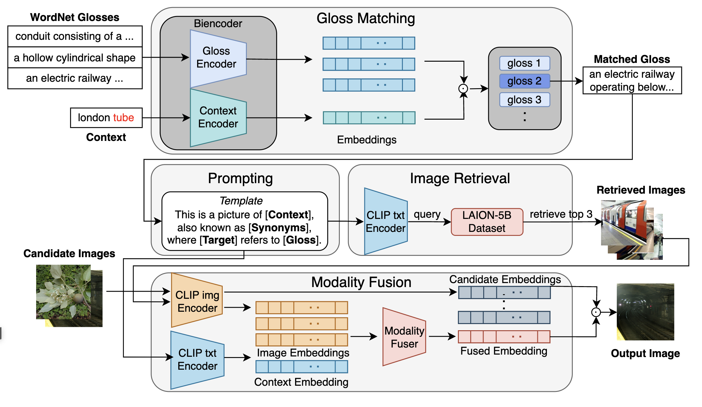

# HKUST at SemEval-2023 Task 1: Visual Word Sense Disambiguation with Context Augmentation and Visual Assistance

This repository is for our work at the [SemEval-2023 Task1](https://raganato.github.io/vwsd/).



Our system is composed of 4 major components, i.e., gloss matching, prompting, image retrieval and modality fusion.

## Data and pretrained weights
You may access the V-WSD training data [here](https://drive.google.com/file/d/1byX4wpe1UjyCVyYrT04sW17NnycKAK7N/view) and test data [here](https://drive.google.com/file/d/15ed8TXY9Pzk68_SCooFm7AfkeFtCd16Q/view). For the images retrieved by our system, you may download them [here](https://drive.google.com/file/d/1wmMrl2LcvulHDQwtpRei_WqHeBHYJ62c/view?usp=sharing). The pretrained weights of the biencoder can be downloaded [here](https://drive.google.com/file/d/1NZX_eMHQfRHhJnoJwEx2GnbnYIQepIQj/edit).

## Dependencies

To run this code, you will need to install the following libraries.

```
pip install pytorch_transformers
pip install open_clip_torch
pip install einops
```
